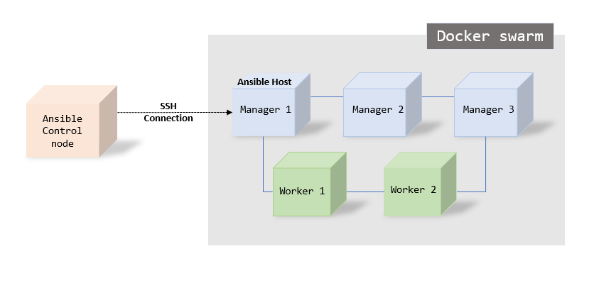
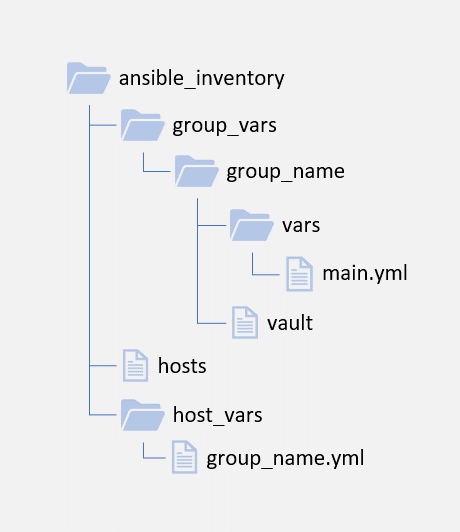

# Eagle Deployment

### Architecture

Eagle is built on [Sunbird](https://www.sunbird.org/ "Sunbird"). To know more about Sunbird visit their website https://www.sunbird.org/

The deployment architecture of Eagle is from Sunbird. Refer the __Subird Github Repository__ - https://github.com/project-sunbird/sunbird-devops

## Deployment
The deployment of Sunbird is done in 3 modules. They are as follows
  1. Core
  2. Knowledge Platform
  3. Data Pipeline

Eagle deployment uses the Knowledge Platform aand Data Pipeline as-is, where as the core uses a different set of application deployments all together callled as Eagle Core.

### Prerequisites
  1. Operating System - Linux based: Preferably [Ubuntu](https://ubuntu.com/)
  2. Contaier orchestration platform - [Docker swarm](https://docs.docker.com/engine/swarm/)
  3. Application deployment/Configuration management tool - [Ansible](https://www.ansible.com/)

Eagle core uses Sunbird's architecture for the underlying infrastructure. All aplications are deployed as services on Docker swarm and deployments are done using Ansible. Configuration management for these app services also use ansible.

### Docker swarm Architecture
Subird recommends a minimum of 3 masters and 2 worker nodes for a minimal HA setup for it's app services. This does not include the Databases, Logging and DevOps VMs.
Since Eagle's underlying architecture is based on sunbird, the recommendation is inherited.

However, the number of Virtual machine and the capcity of them will depend on the usage requirements of each deployment.

__Example:__
A minimal Docker swarm with 5 VMs on AWS would be named and deployed as follows
  1. Manager 1 - AZ 1A
  2. Manager 2 - AZ 1A
  3. Manager 3 - AZ 1B
  4. Worker 1 - AZ 1A
  5. Worker 2 - AZ 1B

### Connectivity
Ansible's connectivity should be enabled between the Ansible Control node and Ansible Managed node (host).

Docker swarm deplyments happen only on through the manager nodes and hence we configure our manger nodes as Ansible host.

Right now, Eagle setup is configured  a single manager node as a Ansible host and the user used for deployment needs to have access to docker group on the manager node.

_Image: Ansible connectivty for application deployment._

### Ansible project structure
All application deployment of Eagle are performed by ansible playbooks. Each application service is created as a role.

Every role has a responsibility to deploy a single docker service onto the docker swarm and all the components needed for it. This way we keep each role seperate and maintain a one-to-one relationship between the service and the role.

__Aim__:
  The aim of each role is to create a docker compose file(.yml) and an environemt file(.env) using templates of ansible playbook which the docker service will be using to perform a deployment on the master node.

__Variables__:
  Variables for these roles are seperated and stored at 3 different levels
  1. Inventory - This is where we store variables which are different for different environments. (Example: Dev, Stage, Prod) or different instances of Eagle and which are shared between multiple roles/services
  2. Role Level - This is where we store variables which are specific to the role/docker service. (Example: Location of env files, any configs specific to a particular service)
  3. Playbook Level - This is where we store variables which would not change with environment, but will be used between multiple roles/services. (Example: service names of other services, ports of other services)

  Other than this, there is one special case where variables are stored, which is the common vars place. This is used for the usecase where a single file is used as a whole for multiple services. (Example: UI-Shared in Eagle instance)

__Inventory Structure__:
  A sample structure is uploaded here (Add link here). Pictorial representation of the structre is below  

  

  _Image: Ansible inventory directory structure_

__Roles__:
  Roles follow ansile playbook roles structure.
